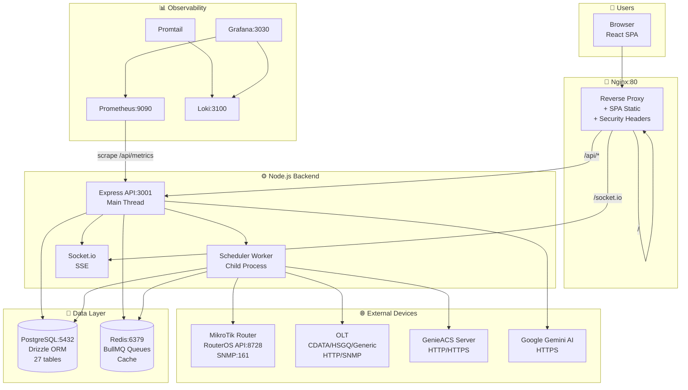
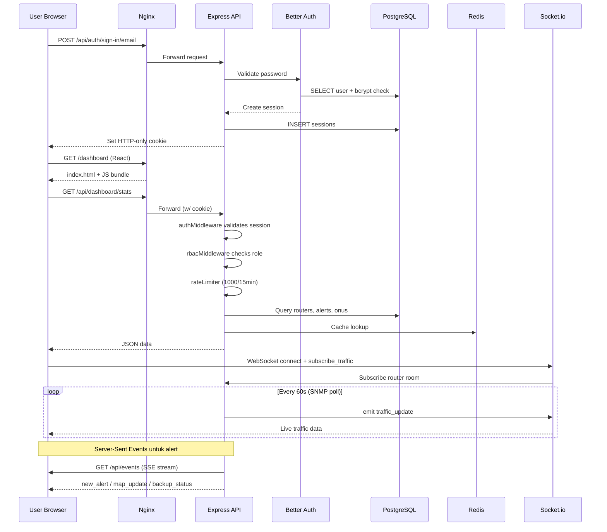
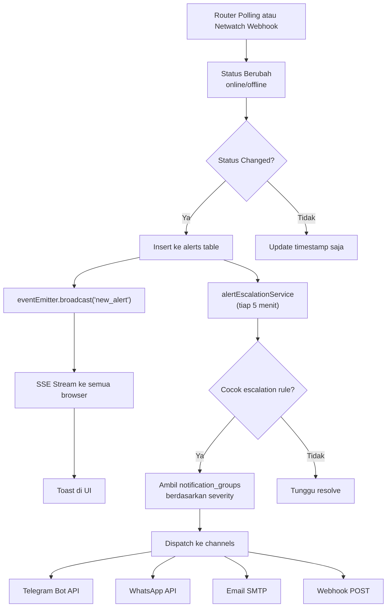
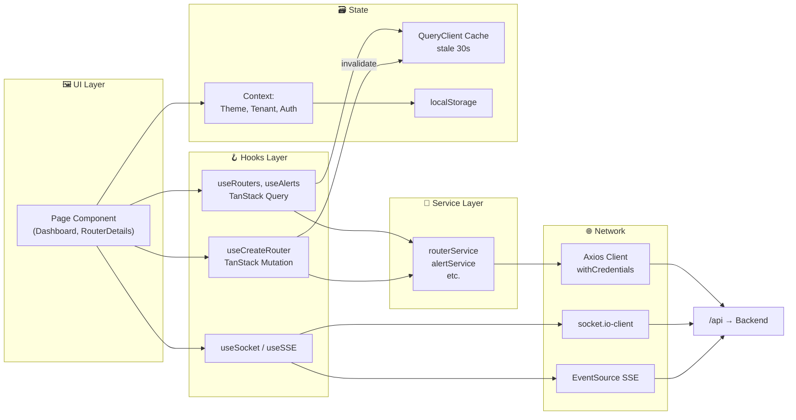
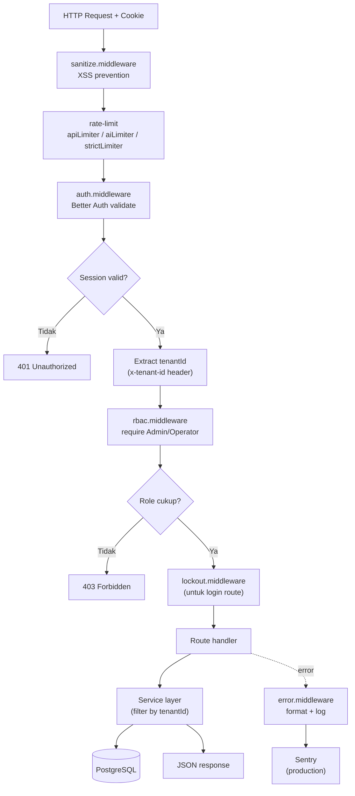
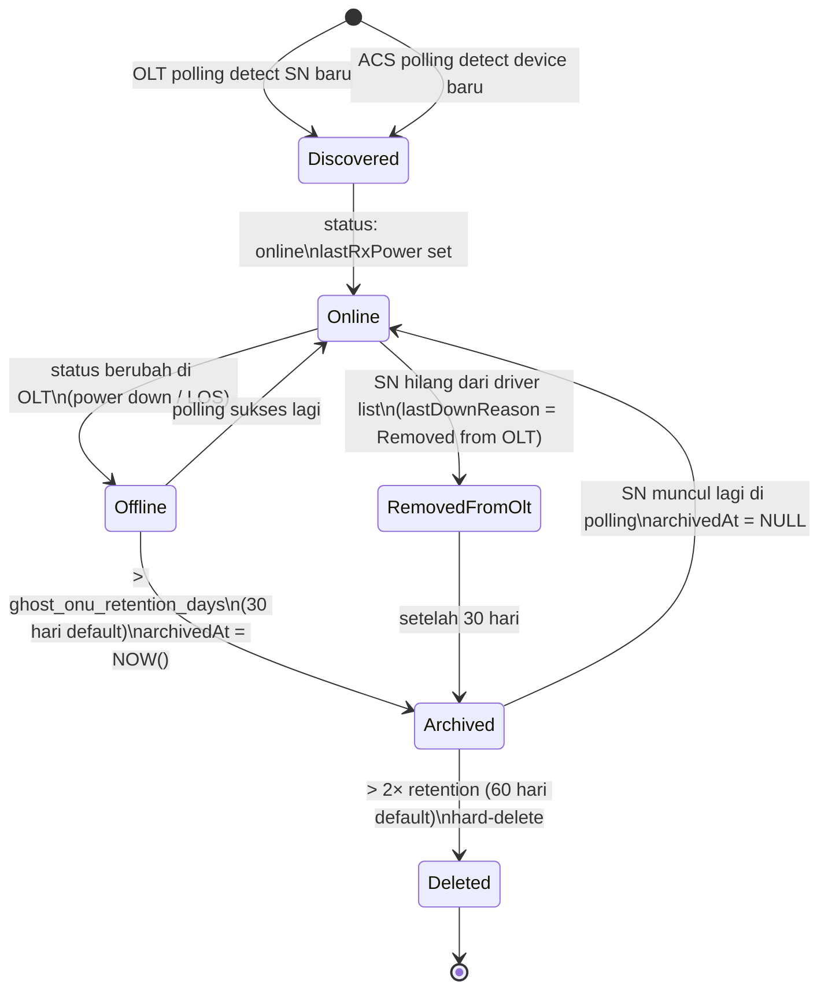

# Arsitektur Sistem — Maps Network Monitor

Dokumentasi arsitektur lengkap untuk platform monitoring jaringan MikroTik multi-tenant. Berisi 6 diagram alur (dirender via Mermaid) + tabel referensi komponen, protokol eksternal, dan jadwal scheduler.

> **Cara melihat diagram:** di VS Code, buka file ini dan tekan `Ctrl+Shift+V`. Pastikan extension *Markdown Preview Mermaid Support* terinstall. Di GitHub, diagram akan otomatis ter-render di browser.

---

## Overview

**Maps Network Monitor** adalah platform monitoring jaringan multi-tenant untuk ISP yang mengelola perangkat MikroTik, OLT (Optical Line Terminal), dan CPE via GenieACS. Frontend React SPA berkomunikasi dengan backend Express via REST + WebSocket + SSE; backend melakukan polling periodik ke perangkat jaringan menggunakan BullMQ queue workers dan menyimpan metrik historis di PostgreSQL + TimescaleDB. Observability stack (Prometheus + Grafana + Loki) berjalan terpisah untuk monitoring infrastruktur.

**Fitur utama operasional (v1.2.x):**
- **ONU lifecycle**: orphan auto-detect dari OLT, soft-archive setelah 30 hari offline, hard-delete setelah 60 hari, auto-restore kalau SN muncul lagi
- **Per-source freshness** (`lastSeenOlt` / `lastSeenAcs`): badge "Hilang di OLT/ACS/Ghost" muncul otomatis di UI kalau salah satu sumber data berhenti melapor > 2 jam
- **TimescaleDB compression**: policy compress chunk > 7 hari, menghemat 80-95% disk untuk metrics history
- **Retention tuning**: interface traffic (TX/RX) 400 hari, metrics/signal/PPPoE/alert 60 hari, audit logs 90 hari
- **Auto-maintenance**: daily cleanup retention, auto-backup harian dengan `pg_dump --compress=9`, log rotation PM2
- **Tab OLT & ACS di Edit Device modal map**: reboot ONU, reboot CPE, change WiFi SSID, archive dari aplikasi — semua inline tanpa navigasi pindah halaman

---

## 1. Arsitektur Keseluruhan



---

## 2. Alur Request User (Login → Dashboard)



---

## 3. Alur Background Scheduler & Queue

```mermaid
graph LR
    subgraph SCHED["⏰ Scheduler (Worker Process)"]
        direction TB
        S1["pollAllRouters<br/>30s-5min adaptive"]
        S2["pollRoutersSnmp<br/>60s"]
        S3["pollOltsSnmp<br/>5 min"]
        S4["pollOltsWeb<br/>15 min"]
        S5["syncGenieAcs<br/>10 min"]
        S6["checkAlertEscalation<br/>5 min"]
        S7["updatePrometheusMetrics<br/>60s"]
        S8["cleanupOldMetrics<br/>24h"]
        S9["automatedBackup<br/>24h"]
    end

    subgraph Q["📬 BullMQ Queues (Redis)"]
        RQ["router-sync<br/>concurrency: 10<br/>2 retries"]
        OQ["olt-sync<br/>concurrency: 5<br/>2 retries"]
    end

    subgraph W["👷 Workers"]
        RW["Router Worker<br/>refreshRouterStatus"]
        OW["OLT Worker<br/>refreshStatus + syncInventory"]
    end

    subgraph EXT2["🔌 External Calls"]
        MT["RouterOS API"]
        SNMPP["SNMP poll"]
        OLTT["OLT driver<br/>testConnection + getOnuList"]
        ACSS["GenieACS HTTP"]
    end

    subgraph DB2[("📦 Database")]
        T1["routers / router_metrics"]
        T2["router_interface_metrics"]
        T3["olts / onus"]
        T4["alerts / audit_logs"]
        T5["genieacs_backups"]
    end

    subgraph NOTIF["📢 Notifications"]
        TG["Telegram"]
        WA["WhatsApp"]
        EM["Email SMTP"]
        WH["Webhook"]
    end

    S1 --> RQ
    S2 --> SNMPP
    S3 --> OQ
    S4 --> OQ
    S5 --> ACSS
    S6 --> NOTIF

    RQ --> RW --> MT
    OQ --> OW --> OLTT

    RW --> T1
    RW --> T2
    SNMPP --> T2
    OW --> T3
    ACSS --> T5
    S6 --> T4

    S8 --> T1
    S8 --> T4
```

---

## 4. Alur Alert (Deteksi → Notifikasi)



---

## 5. Alur Data Frontend (React + TanStack Query)



---

## 6. Authentication & RBAC Flow



---

## Ringkasan Komponen

| Layer | Teknologi | File / Folder Utama |
|---|---|---|
| Frontend | React 19 + Vite + Tailwind | [apps/web/src/](../apps/web/src/) |
| Routing | React Router v7 + lazy() | [apps/web/src/App.jsx](../apps/web/src/App.jsx) |
| State | TanStack Query + Context | [apps/web/src/hooks/](../apps/web/src/hooks/) |
| Maps | React-Leaflet + clustering | [apps/web/src/components/map/](../apps/web/src/components/map/) |
| Real-time | Socket.io-client + SSE | [apps/web/src/hooks/useSocket.js](../apps/web/src/hooks/useSocket.js) |
| API | Express + TypeScript | [apps/api/src/index.ts](../apps/api/src/index.ts) |
| Auth | Better Auth + bcrypt | [apps/api/src/lib/auth.ts](../apps/api/src/lib/auth.ts) |
| ORM | Drizzle + Zod validation | [apps/api/src/db/schema/](../apps/api/src/db/schema/) |
| Scheduler | setInterval + BullMQ | [apps/api/src/lib/scheduler.ts](../apps/api/src/lib/scheduler.ts) |
| MikroTik | node-routeros + SNMP | [apps/api/src/lib/mikrotik/](../apps/api/src/lib/mikrotik/) |
| OLT Drivers | Factory pattern | [apps/api/src/services/olt-drivers/](../apps/api/src/services/olt-drivers/) |
| Notifications | Axios + Nodemailer | [apps/api/src/services/notification.service.ts](../apps/api/src/services/notification.service.ts) |
| AI | Google Generative AI | [apps/api/src/services/ai.service.ts](../apps/api/src/services/ai.service.ts) |
| Queues | BullMQ + Redis | [apps/api/src/services/queue.service.ts](../apps/api/src/services/queue.service.ts) |
| Observability | Prometheus + Grafana + Loki | [prometheus.yml](../prometheus.yml), [grafana/](../grafana/) |
| Deployment | PM2 (Proxmox) / Docker | [ecosystem.config.cjs](../ecosystem.config.cjs), [docker-compose.yml](../docker-compose.yml) |

---

## Periodic Tasks Schedule

Semua task ini dijalankan oleh scheduler worker — lihat [apps/api/src/lib/scheduler.ts](../apps/api/src/lib/scheduler.ts).

| Task | Interval | Target | Fungsi |
|---|---|---|---|
| `pollAllRouters` | 30s–5min (adaptive) | router-sync queue | Status, metrics, netwatch semua router |
| `pollRoutersSnmp` | 60s | routers via SNMP | Traffic counters real-time |
| `pollOltsSnmp` | 5 min | olt-sync queue | OLT refresh status (SNMP) |
| `pollOltsWeb` | 15 min | olt-sync queue | OLT inventory sync + ONU list (+ orphan detection) |
| `syncGenieAcs` | 10 min | GenieACS HTTP | Device metadata + firmware + connected hosts |
| `warmAcsDashboard` | 60s | GenieACS cache | Pre-warm dashboard statistics |
| `checkAlertEscalation` | 5 min | alerts + notifications | Cek unresolved alerts + escalate |
| `updatePrometheusMetrics` | 60s | in-memory gauges | Update Prometheus metrics |
| `cleanupOldMetrics` | 24h | metrics tables | Hapus data > retention + archive/delete ghost ONU |
| `automatedBackup` | 24h | `/opt/app/backups` | Auto-backup DB `pg_dump --compress=9` |
| `policy_compression` (TimescaleDB) | 12h | hypertables | Compress chunks > 7 hari — dikelola TimescaleDB bg worker, bukan scheduler app |

**Adaptive scaling tiers** untuk polling router:
- ≤50 devices: 30s interval, batch 20 — *Full Check*
- ≤200 devices: 60s interval, batch 15 — *Batching*
- ≤500 devices: 120s interval, batch 10 — *Priority + Batching*
- \>500 devices: 300s interval, batch 5 — *Sampling*

---

## External Protocols

| Target | Protokol | Port | Library | Use Case |
|---|---|---|---|---|
| MikroTik Router | RouterOS API | 8728 (TCP) | node-routeros | System info, interfaces, netwatch, PPPoE |
| MikroTik Router | SNMP v2c/v3 | 161 (UDP) | net-snmp | Interface traffic counters |
| OLT (CDATA) | HTTP | 80/443 | fetch (built-in) | Web API: login + ONU list probing |
| OLT (HSGQ) | HTTP | 80/443 | fetch | Modern/legacy REST endpoints |
| OLT (semua) | SNMP | 161 (UDP) | net-snmp | Signal strength, ONU counters |
| GenieACS | HTTP/HTTPS | user-defined | axios | CPE management via TR-069 |
| Google Gemini | HTTPS | 443 | @google/generative-ai | AI diagnostic, network summary |
| Telegram | HTTPS | 443 | axios | Bot API untuk notifikasi |
| WhatsApp | HTTPS | user-defined | axios | go-whatsapp-web-multidevice |
| Email (SMTP) | SMTP/STARTTLS | 587/465 | nodemailer | Alert email |
| Webhook (outbound) | HTTP/HTTPS | user-defined | axios | Custom integration |
| MikroTik Webhook (inbound) | HTTP | 3001 (API) | Express route | Netwatch push dari router |

---

## ONU Lifecycle Management

ONU (Optical Network Unit) punya lifecycle yang di-orchestrate backend:



**Field lifecycle di `onus` table:**

| Field | Di-set oleh | Maksud |
|---|---|---|
| `status` | OLT driver | online / offline / lost / power_down / dying_gasp / unknown |
| `lastDownReason` | OLT driver / orphan detector | Penyebab offline (misal "Removed from OLT", "Power Down") |
| `lastSeenOlt` | `syncOnuInventory` | Timestamp terakhir OLT melaporkan SN ini |
| `lastSeenAcs` | `syncMetadata` | Timestamp terakhir ACS inform untuk SN ini |
| `archivedAt` | `cleanupGhostOnus` OR tombol "Hapus dari Aplikasi" | Soft-delete marker (NULL = aktif) |
| `discoverySources` | both syncs | JSON array: `['olt']`, `['acs']`, atau `['olt', 'acs']` |
| `activeClients` | ACS sync | Jumlah device terhubung (dari `HostNumberOfEntries` atau `Host.X Active=true`) |

**UI indikator "Sync Health"** di popup map & tabel ONU (threshold 2 jam):

| Kondisi `lastSeenOlt` | Kondisi `lastSeenAcs` | Badge |
|---|---|---|
| Fresh (< 2h) | Fresh | *(tidak tampil — normal)* |
| Stale (> 2h) | Fresh | 🔴 **Hilang di OLT** |
| Fresh | Stale (> 2h) | 🟡 **Hilang di ACS** |
| Stale | Stale | 💗 **Ghost ONU** (kandidat archive) |
| NULL (belum sync) | — | *(tidak tampil — belum punya baseline)* |

**Tombol "Hapus dari Aplikasi"** di 2 lokasi:
- Halaman OLT → tabel ONU → kolom actions (ikon 🗑️)
- Map → popup ONU → tombol delete di header

Implementasi shared helper: [apps/web/src/lib/onuSourceHealth.js](../apps/web/src/lib/onuSourceHealth.js)

---

## TimescaleDB Compression & Retention

Data metrics historis bisa membengkak cepat (~100-150 MB/hari untuk 12 router × 200+ ONU). Strategi penyimpanan:

### 3 Hypertable

| Hypertable | Isi | Chunk Interval | Retention | Compression |
|---|---|---|---|---|
| `router_interface_metrics` | TX/RX rate + bytes per interface | 7 hari | **400 hari** (> 1 tahun) | segmentby `tenant_id, interface_id`, orderby `recorded_at DESC, id` |
| `device_performance_history` | Latency + ONU signal per device | 7 hari | 60 hari | segmentby `tenant_id, router_id`, orderby `recorded_at DESC` |
| `router_metrics` | CPU/RAM/disk per router | 7 hari | 60 hari | segmentby `tenant_id, router_id`, orderby `recorded_at DESC` |

### Compression Policy

- Policy: `add_compression_policy('<table>', INTERVAL '7 days')`
- Scheduler TimescaleDB: cek tiap 12 jam, compress chunk yang `range_end < NOW() - 7 days`
- Hasil kompresi: 80-95% space saved (tipikal 500MB → 40MB per chunk)
- **Penting:** `repair-db.ts` sudah di-patch (commit `a7bcef1`) untuk **tidak** mendecompress chunk. Untuk force-decompress (jarang perlu, mis. schema migration), set `REPAIR_DB_FORCE_DECOMPRESS=1` saat run script.

### Retention Scheduler

`cleanupOldMetrics()` di [scheduler.ts](../apps/api/src/lib/scheduler.ts) jalan harian, DELETE baris dengan `recorded_at < NOW() - retention_days`. Retention diatur per-tenant lewat `app_settings`:

```sql
SELECT key, value FROM app_settings WHERE key LIKE '%retention%';
-- interface_metrics_retention_days = 400
-- metrics_retention_days = 60
-- performance_retention_days = 60
-- alerts_retention_days = 60
-- pppoe_retention_days = 60
-- audit_logs_retention_days = 90
-- backups_retention_days = 90
-- ghost_onu_retention_days = 30
```

---

## Database Migrations

Drizzle migrations di [apps/api/src/db/migrations/](../apps/api/src/db/migrations/). Tracked di journal [`meta/_journal.json`](../apps/api/src/db/migrations/meta/_journal.json). Dijalankan otomatis saat `npm run db:migrate` (bagian dari `update-server.sh`).

Migration terbaru yang menambah capability operasional:

| # | Tag | Tujuan |
|---|---|---|
| 0033 | `add_missing_indexes` | Index pada `routers(tenant_id)`, `users(tenant_id)`, `sessions(user_id)` — mempercepat query per-tenant |
| 0034 | `add_onu_archived_at` | Kolom `onus.archived_at` + index — fondasi soft-delete ghost ONU |
| 0035 | `add_onu_source_timestamps` | Kolom `onus.last_seen_olt` + `last_seen_acs` — per-source freshness tracking |
| 0036 | `backfill_onu_source_timestamps` | Isi kedua kolom di atas dengan `updated_at` untuk record existing (biar tidak false-positive "stale") |
| 0037 | `add_onu_active_clients` | Kolom `onus.active_clients` — persist jumlah client terhubung dari ACS |

Migration 0001-0032 dibuat dari Drizzle Kit berdasarkan perubahan schema — nama teracak (`0018_lush_vapor`, dst.) karena generator.

---

## Production Operations

### Auto-Backup

- **Command**: `pg_dump mikrotik_monitor --format=plain --compress=9 -f auto-bkp-<ISO>.sql.gz`
- **Frequency**: 24 jam, trigger awal 4 menit setelah API start (`setTimeout`)
- **Retention**: 7 hari (file `auto-bkp-*` yang > 7 hari di-unlink oleh `cleanupOldBackups()`)
- **Lokasi**: `/opt/app/backups/`
- **Log sukses**: `💾 Database backup written { file, sizeBytes, durationMs }`
- **Log gagal**: exit code + 500 char pertama dari `stderr` pg_dump
- **Config file**: [apps/api/src/services/backup.service.ts](../apps/api/src/services/backup.service.ts)

### PM2 Process Management

- **Ecosystem config**: [ecosystem.config.cjs](../ecosystem.config.cjs)
- **Processes**: `monitoring-api` (fork mode), `monitoring-web` (static serve)
- **Auto-startup on boot**: `pm2 startup` + `pm2 save` — systemd unit
- **Log rotation** (via `pm2-logrotate` module):
  - `max_size: 50M`, `retain: 14`, `compress: true`, rotate `0 0 * * *` (tengah malam)
  - Output: `/root/.pm2/logs/monitoring-api-{out,error}.log*.gz`
- **Restart policy**: `max_memory_restart: 800M` (opsional, set manual) — auto-restart kalau memory leak

### Log Hygiene

Dua patch untuk mengurangi log noise (commit `e7ecf3b`):
1. **MikroTik connection pool purge warning** — rate-limited ke 1 log per host per 60 detik ([lib/mikrotik/connection.ts](../apps/api/src/lib/mikrotik/connection.ts))
2. **Telegram error detail** — unpack `error.response.status` + `description`/`error_code`/body ([services/notification.service.ts](../apps/api/src/services/notification.service.ts))

### Superadmin Maintenance Guide (In-App)

Settings → **Panduan Sistem** (tab hanya muncul untuk role `superadmin`, ada badge "SA"). Berisi 5 seksi collapsible:
- Pengecekan harian (PM2, Redis, disk, backup, error)
- Pengecekan mingguan (compression, queue, retention, ghost ONU)
- Maintenance bulanan (VACUUM, journal vacuum, table size, npm audit)
- Troubleshooting (Redis MISCONF, backup fail, ONU hilang, router sync, Telegram, disk full, slow)
- Referensi konfigurasi (retention plan, compression setup, PM2 rotation, update deploy, file paths)

Setiap item punya command block dengan tombol Copy, "Yang Diharapkan" (success criteria), dan "Kalau Gagal" (recovery steps).

Source: [apps/web/src/components/settings/SystemHealthGuide.jsx](../apps/web/src/components/settings/SystemHealthGuide.jsx)

---

## Environment Variables Utama

File template: [.env.example](../.env.example)

| Variable | Required | Fungsi |
|---|---|---|
| `DATABASE_URL` | ✅ | PostgreSQL connection string |
| `REDIS_URL` | ✅ | Redis untuk BullMQ + cache |
| `BETTER_AUTH_SECRET` | ✅ | Secret untuk session encryption (min 16 char) |
| `ENCRYPTION_KEY` | ✅ | 32-char key untuk encrypt password perangkat |
| `CORS_ORIGIN` | ✅ | Trusted frontend origin |
| `BETTER_AUTH_URL` | optional | Base URL Better Auth endpoint |
| `GEMINI_API_KEY` | optional | Fallback system-wide AI key |
| `SENTRY_DSN` | optional | Production error tracking |
| `REDIS_PASSWORD` | untuk Docker | Password Redis container |
| `VITE_API_URL` | frontend | API base URL (dev: http://localhost:3001/api) |
| `VITE_WS_URL` | frontend | WebSocket URL (dev: http://localhost:3001) |

---

## Role & Permission Hierarchy

`superadmin` > `admin` > `operator` > `user`

| Feature | superadmin | admin | operator | user |
|---|:---:|:---:|:---:|:---:|
| Tenants CRUD | ✅ | ❌ | ❌ | ❌ |
| Users CRUD | ✅ | ✅ | ❌ | ❌ |
| Notification Groups | ✅ | ✅ | ❌ | ❌ |
| Netwatch management | ✅ | ✅ | ❌ | ❌ |
| Routers CRUD | ✅ | ✅ | ✅ | ❌ |
| OLT CRUD | ✅ | ✅ | ✅ | ❌ |
| Analytics | ✅ | ✅ | ✅ | ❌ |
| View-only dashboard | ✅ | ✅ | ✅ | ✅ |

User biasa hanya melihat router yang secara eksplisit di-assign via tabel `user_routers`.

---

## Deployment Options

### Proxmox (PM2 native)
```bash
cd /opt/app && ./scripts/update-server.sh
```
Script menjalankan: git pull → npm install → build → db:migrate → db:repair → pm2 reload. PostgreSQL + Redis berjalan native di host.

### Docker Compose
```bash
docker-compose up -d
```
Stack lengkap: db, redis, api, web, prometheus, grafana, loki, promtail. Monitoring ports (9090, 3030, 3100) di-bind ke 127.0.0.1 — akses via SSH tunnel.

---

## Referensi Tambahan

- [README.md](../README.md) — getting started & instalasi
- [TROUBLESHOOTING.md](../TROUBLESHOOTING.md) — pemecahan masalah umum
- [UPDATE_GUIDE.md](../UPDATE_GUIDE.md) — panduan update
- [RELEASING.md](../RELEASING.md) — proses rilis versi
- [docs/DATABASE_SYNC.md](DATABASE_SYNC.md) — mekanisme sinkronisasi DB
- [SCALABILITY_REPORT.md](../SCALABILITY_REPORT.md) — benchmark & kapasitas
- [SYSTEM_ANALYSIS.md](../SYSTEM_ANALYSIS.md) — analisis sistem detail

**Dalam aplikasi (live):**
- **Settings → Panduan Sistem** (tab superadmin-only) — 25+ command siap-copy untuk maintenance harian/mingguan/bulanan & troubleshooting
- **Settings → Maintenance** — retention periods, manual backup/restore, delete old backup
- **Olts → OLT Details** — monitor & manage ONU inventory, archive ghost ONU
- **Router Details → Netwatch/PPPoE/Neighbors** — device monitoring per-router
- **GenieACS page** — CPE management (reboot, WiFi config, factory reset)

---

## Changelog Singkat (v1.2.x)

**Security (Phase 1)**
- User enumeration fix, route order bug, rate limit tuning, SQL blocklist di backup restore, lockout limit reduction

**Performance (Phase 2)**
- Migration 0033: index `tenant_id` pada `routers`, `users`, dan `sessions` — mempercepat query filter per-tenant

**Infra (Phase 3)**
- Docker hardening (Redis auth, healthcheck, port binding), Prometheus scrape target fix, Nginx SSL stubs, SQL injection fix di scheduler batchDelete

**OLT Fix (Phase 4)**
- `refreshStatus()` pakai `testConnection()` real (bukan cuma `connect()` no-op), clear stale `statusReason`, orphan detection saat sync

**Data Quality (Phase 6-7)**
- Ghost ONU cleanup (migration 0034), per-source timestamps (0035-0036), active clients persistence (0037)
- UI source health badges, archive button, connected devices list di ACS tab

**UX (Phase 7)**
- OLT + ACS tabs di Edit Device modal map, sticky/scroll pattern di 7 data tables, latency fallback + Last Down row

**Operations (v1.2.x)**
- Backup pg_dump syntax fix (`--compress=9`), repair-db preserve compression, log spam rate-limit, Telegram error detail unpacking
- TimescaleDB compression policies (retention 400 hari untuk traffic, compression 7 hari)
- PM2 auto-startup + log rotation, Better Auth trusted proxies
- Superadmin maintenance guide in-app
