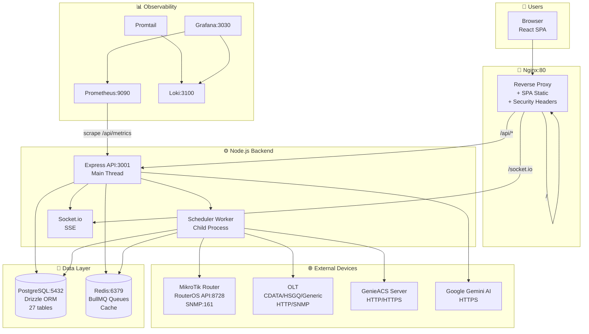
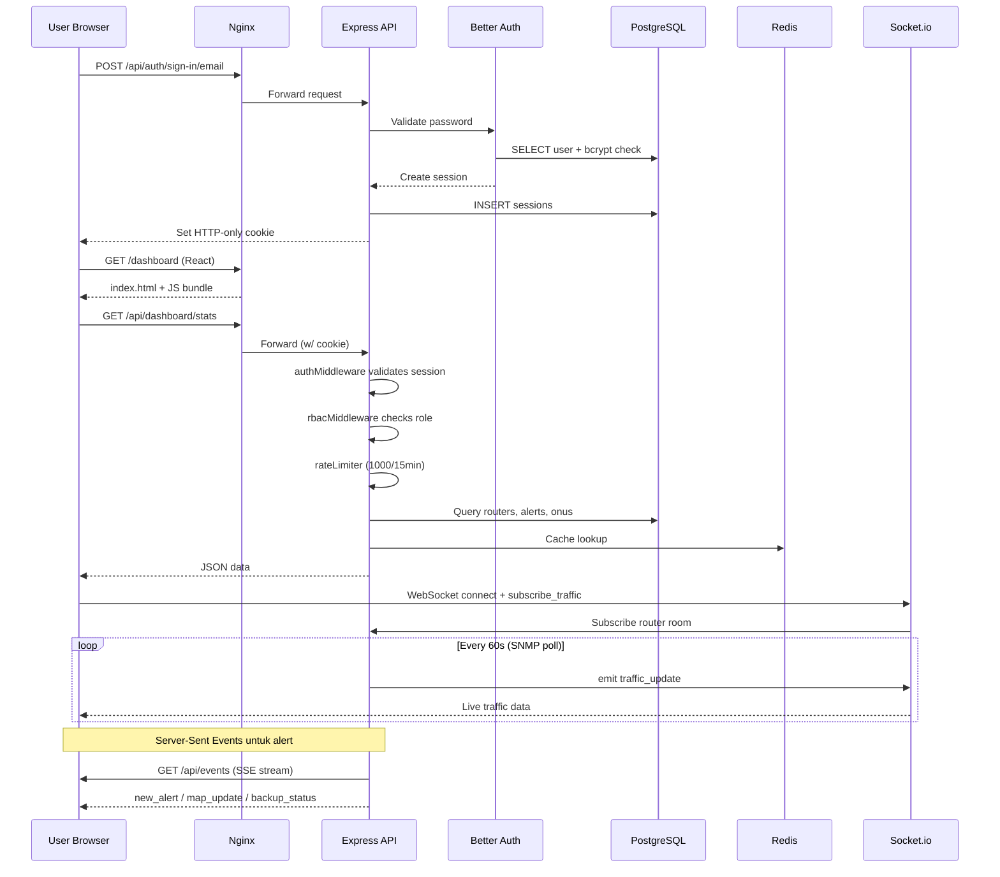
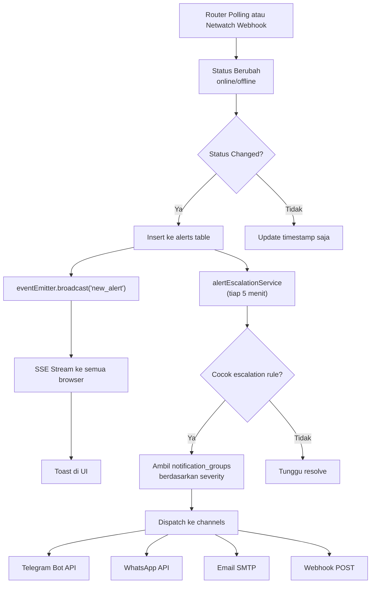
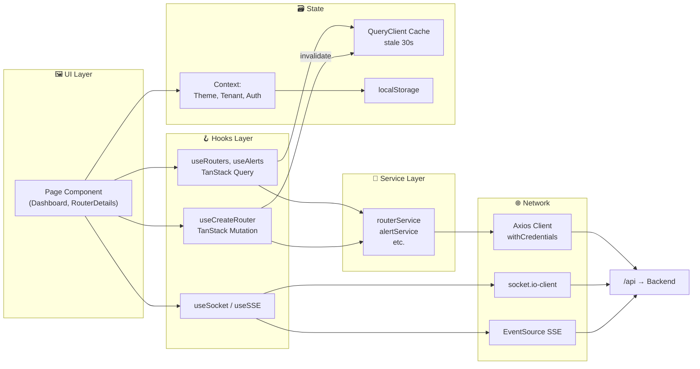
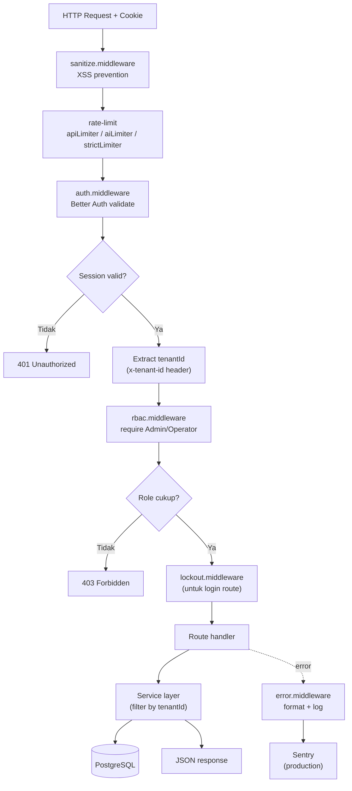

# Arsitektur Sistem — Maps Network Monitor

Dokumentasi arsitektur lengkap untuk platform monitoring jaringan MikroTik multi-tenant. Berisi 6 diagram alur (dirender via Mermaid) + tabel referensi komponen, protokol eksternal, dan jadwal scheduler.

> **Cara melihat diagram:** di VS Code, buka file ini dan tekan `Ctrl+Shift+V`. Pastikan extension *Markdown Preview Mermaid Support* terinstall. Di GitHub, diagram akan otomatis ter-render di browser.

---

## Overview

**Maps Network Monitor** adalah platform monitoring jaringan multi-tenant untuk ISP yang mengelola perangkat MikroTik, OLT (Optical Line Terminal), dan CPE via GenieACS. Frontend React SPA berkomunikasi dengan backend Express via REST + WebSocket + SSE; backend melakukan polling periodik ke perangkat jaringan menggunakan BullMQ queue workers dan menyimpan metrik historis di PostgreSQL. Observability stack (Prometheus + Grafana + Loki) berjalan terpisah untuk monitoring infrastruktur.

---

## 1. Arsitektur Keseluruhan



---

## 2. Alur Request User (Login → Dashboard)



---

## 3. Alur Background Scheduler & Queue

```mermaid
graph LR
    subgraph SCHED["⏰ Scheduler (Worker Process)"]
        direction TB
        S1["pollAllRouters<br/>30s-5min adaptive"]
        S2["pollRoutersSnmp<br/>60s"]
        S3["pollOltsSnmp<br/>5 min"]
        S4["pollOltsWeb<br/>15 min"]
        S5["syncGenieAcs<br/>10 min"]
        S6["checkAlertEscalation<br/>5 min"]
        S7["updatePrometheusMetrics<br/>60s"]
        S8["cleanupOldMetrics<br/>24h"]
        S9["automatedBackup<br/>24h"]
    end

    subgraph Q["📬 BullMQ Queues (Redis)"]
        RQ["router-sync<br/>concurrency: 10<br/>2 retries"]
        OQ["olt-sync<br/>concurrency: 5<br/>2 retries"]
    end

    subgraph W["👷 Workers"]
        RW["Router Worker<br/>refreshRouterStatus"]
        OW["OLT Worker<br/>refreshStatus + syncInventory"]
    end

    subgraph EXT2["🔌 External Calls"]
        MT["RouterOS API"]
        SNMPP["SNMP poll"]
        OLTT["OLT driver<br/>testConnection + getOnuList"]
        ACSS["GenieACS HTTP"]
    end

    subgraph DB2[("📦 Database")]
        T1["routers / router_metrics"]
        T2["router_interface_metrics"]
        T3["olts / onus"]
        T4["alerts / audit_logs"]
        T5["genieacs_backups"]
    end

    subgraph NOTIF["📢 Notifications"]
        TG["Telegram"]
        WA["WhatsApp"]
        EM["Email SMTP"]
        WH["Webhook"]
    end

    S1 --> RQ
    S2 --> SNMPP
    S3 --> OQ
    S4 --> OQ
    S5 --> ACSS
    S6 --> NOTIF

    RQ --> RW --> MT
    OQ --> OW --> OLTT

    RW --> T1
    RW --> T2
    SNMPP --> T2
    OW --> T3
    ACSS --> T5
    S6 --> T4

    S8 --> T1
    S8 --> T4
```

---

## 4. Alur Alert (Deteksi → Notifikasi)



---

## 5. Alur Data Frontend (React + TanStack Query)



---

## 6. Authentication & RBAC Flow



---

## Ringkasan Komponen

| Layer | Teknologi | File / Folder Utama |
|---|---|---|
| Frontend | React 19 + Vite + Tailwind | [apps/web/src/](../apps/web/src/) |
| Routing | React Router v7 + lazy() | [apps/web/src/App.jsx](../apps/web/src/App.jsx) |
| State | TanStack Query + Context | [apps/web/src/hooks/](../apps/web/src/hooks/) |
| Maps | React-Leaflet + clustering | [apps/web/src/components/map/](../apps/web/src/components/map/) |
| Real-time | Socket.io-client + SSE | [apps/web/src/hooks/useSocket.js](../apps/web/src/hooks/useSocket.js) |
| API | Express + TypeScript | [apps/api/src/index.ts](../apps/api/src/index.ts) |
| Auth | Better Auth + bcrypt | [apps/api/src/lib/auth.ts](../apps/api/src/lib/auth.ts) |
| ORM | Drizzle + Zod validation | [apps/api/src/db/schema/](../apps/api/src/db/schema/) |
| Scheduler | setInterval + BullMQ | [apps/api/src/lib/scheduler.ts](../apps/api/src/lib/scheduler.ts) |
| MikroTik | node-routeros + SNMP | [apps/api/src/lib/mikrotik/](../apps/api/src/lib/mikrotik/) |
| OLT Drivers | Factory pattern | [apps/api/src/services/olt-drivers/](../apps/api/src/services/olt-drivers/) |
| Notifications | Axios + Nodemailer | [apps/api/src/services/notification.service.ts](../apps/api/src/services/notification.service.ts) |
| AI | Google Generative AI | [apps/api/src/services/ai.service.ts](../apps/api/src/services/ai.service.ts) |
| Queues | BullMQ + Redis | [apps/api/src/services/queue.service.ts](../apps/api/src/services/queue.service.ts) |
| Observability | Prometheus + Grafana + Loki | [prometheus.yml](../prometheus.yml), [grafana/](../grafana/) |
| Deployment | PM2 (Proxmox) / Docker | [ecosystem.config.cjs](../ecosystem.config.cjs), [docker-compose.yml](../docker-compose.yml) |

---

## Periodic Tasks Schedule

Semua task ini dijalankan oleh scheduler worker — lihat [apps/api/src/lib/scheduler.ts](../apps/api/src/lib/scheduler.ts).

| Task | Interval | Target | Fungsi |
|---|---|---|---|
| `pollAllRouters` | 30s–5min (adaptive) | router-sync queue | Status, metrics, netwatch semua router |
| `pollRoutersSnmp` | 60s | routers via SNMP | Traffic counters real-time |
| `pollOltsSnmp` | 5 min | olt-sync queue | OLT refresh status (SNMP) |
| `pollOltsWeb` | 15 min | olt-sync queue | OLT inventory sync + ONU list |
| `syncGenieAcs` | 10 min | GenieACS HTTP | Device metadata + firmware info |
| `warmAcsDashboard` | 60s | GenieACS cache | Pre-warm dashboard statistics |
| `checkAlertEscalation` | 5 min | alerts + notifications | Cek unresolved alerts + escalate |
| `updatePrometheusMetrics` | 60s | in-memory gauges | Update Prometheus metrics |
| `cleanupOldMetrics` | 24h | DB partition tables | Hapus data lama (retention-based) |
| `automatedBackup` | 24h | router_backups | Auto-backup config router |

**Adaptive scaling tiers** untuk polling router:
- ≤50 devices: 30s interval, batch 20 — *Full Check*
- ≤200 devices: 60s interval, batch 15 — *Batching*
- ≤500 devices: 120s interval, batch 10 — *Priority + Batching*
- \>500 devices: 300s interval, batch 5 — *Sampling*

---

## External Protocols

| Target | Protokol | Port | Library | Use Case |
|---|---|---|---|---|
| MikroTik Router | RouterOS API | 8728 (TCP) | node-routeros | System info, interfaces, netwatch, PPPoE |
| MikroTik Router | SNMP v2c/v3 | 161 (UDP) | net-snmp | Interface traffic counters |
| OLT (CDATA) | HTTP | 80/443 | fetch (built-in) | Web API: login + ONU list probing |
| OLT (HSGQ) | HTTP | 80/443 | fetch | Modern/legacy REST endpoints |
| OLT (semua) | SNMP | 161 (UDP) | net-snmp | Signal strength, ONU counters |
| GenieACS | HTTP/HTTPS | user-defined | axios | CPE management via TR-069 |
| Google Gemini | HTTPS | 443 | @google/generative-ai | AI diagnostic, network summary |
| Telegram | HTTPS | 443 | axios | Bot API untuk notifikasi |
| WhatsApp | HTTPS | user-defined | axios | go-whatsapp-web-multidevice |
| Email (SMTP) | SMTP/STARTTLS | 587/465 | nodemailer | Alert email |
| Webhook (outbound) | HTTP/HTTPS | user-defined | axios | Custom integration |
| MikroTik Webhook (inbound) | HTTP | 3001 (API) | Express route | Netwatch push dari router |

---

## Environment Variables Utama

File template: [.env.example](../.env.example)

| Variable | Required | Fungsi |
|---|---|---|
| `DATABASE_URL` | ✅ | PostgreSQL connection string |
| `REDIS_URL` | ✅ | Redis untuk BullMQ + cache |
| `BETTER_AUTH_SECRET` | ✅ | Secret untuk session encryption (min 16 char) |
| `ENCRYPTION_KEY` | ✅ | 32-char key untuk encrypt password perangkat |
| `CORS_ORIGIN` | ✅ | Trusted frontend origin |
| `BETTER_AUTH_URL` | optional | Base URL Better Auth endpoint |
| `GEMINI_API_KEY` | optional | Fallback system-wide AI key |
| `SENTRY_DSN` | optional | Production error tracking |
| `REDIS_PASSWORD` | untuk Docker | Password Redis container |
| `VITE_API_URL` | frontend | API base URL (dev: http://localhost:3001/api) |
| `VITE_WS_URL` | frontend | WebSocket URL (dev: http://localhost:3001) |

---

## Role & Permission Hierarchy

`superadmin` > `admin` > `operator` > `user`

| Feature | superadmin | admin | operator | user |
|---|:---:|:---:|:---:|:---:|
| Tenants CRUD | ✅ | ❌ | ❌ | ❌ |
| Users CRUD | ✅ | ✅ | ❌ | ❌ |
| Notification Groups | ✅ | ✅ | ❌ | ❌ |
| Netwatch management | ✅ | ✅ | ❌ | ❌ |
| Routers CRUD | ✅ | ✅ | ✅ | ❌ |
| OLT CRUD | ✅ | ✅ | ✅ | ❌ |
| Analytics | ✅ | ✅ | ✅ | ❌ |
| View-only dashboard | ✅ | ✅ | ✅ | ✅ |

User biasa hanya melihat router yang secara eksplisit di-assign via tabel `user_routers`.

---

## Deployment Options

### Proxmox (PM2 native)
```bash
cd /opt/app && ./scripts/update-server.sh
```
Script menjalankan: git pull → npm install → build → db:migrate → db:repair → pm2 reload. PostgreSQL + Redis berjalan native di host.

### Docker Compose
```bash
docker-compose up -d
```
Stack lengkap: db, redis, api, web, prometheus, grafana, loki, promtail. Monitoring ports (9090, 3030, 3100) di-bind ke 127.0.0.1 — akses via SSH tunnel.

---

## Referensi Tambahan

- [README.md](../README.md) — getting started & instalasi
- [TROUBLESHOOTING.md](../TROUBLESHOOTING.md) — pemecahan masalah umum
- [UPDATE_GUIDE.md](../UPDATE_GUIDE.md) — panduan update
- [RELEASING.md](../RELEASING.md) — proses rilis versi
- [docs/DATABASE_SYNC.md](DATABASE_SYNC.md) — mekanisme sinkronisasi DB
- [SCALABILITY_REPORT.md](../SCALABILITY_REPORT.md) — benchmark & kapasitas
- [SYSTEM_ANALYSIS.md](../SYSTEM_ANALYSIS.md) — analisis sistem detail
